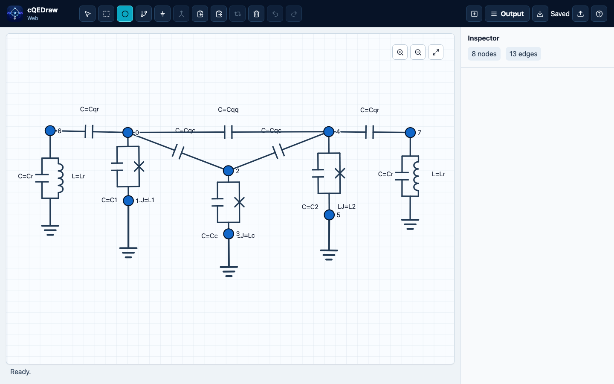

# cQEDraw

cQEDraw draws and analyzes superconducting circuit graphs for Black Box
Quantization workflows. It generates sparse capacitance and inverse-inductance
matrix snippets and can run in-browser modal analysis for supported circuits.
The browser app is the primary interface; new feature work and routine
refactors target the web app. The standalone Tkinter desktop app remains
available as a legacy maintenance-only interface.

**Open the web editor:** https://cqedraw.org/

It is the companion GUI matrix-builder for
[`sccircuits`](https://github.com/joanjcaceres/sccircuits): use the app to draw
the linear circuit, then paste the generated matrices into a Python analysis
that constructs `sccircuits.BBQ` objects. The app remains installable on its
own because it is a launched desktop-style tool, not an imported library API.

[](https://cqedraw.org/)

## What cQEDraw Helps With

- Draw superconducting circuit graphs directly in the browser.
- Generate sparse SciPy capacitance and inverse-inductance matrix snippets.
- Preserve Josephson-junction branch metadata for Black Box Quantization workflows.
- Run in-browser modal analysis for supported circuits without local Python setup.
- Export analysis tables as CSV for downstream notebooks and scripts.

## Share cQEDraw

- Canonical URL: https://cqedraw.org/
- Tagline: Draw and analyze superconducting circuit graphs for Black Box Quantization workflows.
- Social preview image: https://cqedraw.org/social-card.png
- Reusable launch copy: [docs/launch-copy.md](docs/launch-copy.md)

## v0.2.0 Milestone Scope

v0.2.0 is the first web-analysis milestone. It supports drawing circuit graphs,
copying sparse Python matrix snippets, preserving Josephson junction branch
metadata, running in-browser `sccircuits.BBQ` modal analysis, plotting mode
frequencies and Josephson phase zero-point fluctuations, sweeping parameter
values with sliders, and exporting the current analysis table as CSV.

The supported analysis scope is intentionally limited:

- Modal analysis assumes the evaluated capacitance and inverse-inductance
  matrices are well-posed for the generalized eigenvalue problem.
- cQEDraw does not yet model external loop fluxes.
- cQEDraw does not silently reduce, eliminate, or classify free, frozen,
  constrained, periodic, or extended variables.
- Physical graph-to-Hamiltonian reduction is planned for `sccircuits`; cQEDraw
  will preserve and export graph metadata needed by that later layer.

This boundary follows the broader computer-aided circuit quantization problem
discussed in
[Computer-aided quantization and numerical analysis of superconducting circuits](https://iopscience.iop.org/article/10.1088/1367-2630/ac94f2).
Time-dependent external-flux and microwave-drive Hamiltonians are also outside
this milestone; see
[Systematic Construction of Time-Dependent Hamiltonians for Microwave-Driven Josephson Circuits](https://arxiv.org/abs/2512.20743).

The current matrix snippet workflow remains useful outside this scope: advanced
users can copy the sparse matrices and handle reductions or external fluxes in
their own Python analysis.

## Install And Open

### Web App

This is the lowest-friction path and the actively maintained interface:

1. Open https://cqedraw.org/
2. Use cQEDraw in the browser.
3. Install it from the browser menu if you want it in the ChromeOS or desktop launcher.

The web app runs the same Python/SymPy output logic in the browser through
Pyodide. It does not require Python, Pixi, or a terminal on the user's machine.
The GitHub Pages project URL remains available as a fallback during the custom
domain rollout.

### macOS And Windows Legacy Desktop Builds

This path remains available for users who prefer a local desktop app, but the
desktop app is legacy maintenance-only. Use the web app for the actively
maintained interface, including new analysis and plotting features.

1. Open the latest release: https://github.com/joanjcaceres/cqedraw/releases/latest
2. Download `cQEDraw-macOS.zip` on macOS or `cQEDraw-Windows.zip` on Windows.
3. Unzip the downloaded file.
4. Open `cQEDraw.app` on macOS or `cQEDraw.exe` on Windows.

The desktop downloads include Python plus the required NumPy, SciPy, and SymPy
runtime dependencies. They are unsigned beta builds, so macOS or Windows may
show a security warning the first time you open them.

### Linux Or Python Install

Use this path on Linux, or if you prefer to manage Python applications from the
terminal. It requires Python 3.11 or newer and either `pipx` or `pip`. It does
not require Pixi.

Run without a permanent install using `pipx`:

```bash
pipx run --spec git+https://github.com/joanjcaceres/cqedraw.git cqedraw
```

Install with `pip`:

```bash
python -m pip install "cqedraw @ git+https://github.com/joanjcaceres/cqedraw.git"
cqedraw
```

Install together with SCCircuits for analysis examples:

```bash
python -m pip install "cqedraw[sccircuits] @ git+https://github.com/joanjcaceres/cqedraw.git"
```

For Python installs only, Tkinter must be available in your Python
installation. Tkinter is part of the Python standard library, but some Linux
distributions ship it separately. If the app fails with
`ModuleNotFoundError: tkinter`, install your platform's Tk package, for example
`python3-tk` on Debian/Ubuntu.

You can also launch a Python install as a module:

```bash
python -m cqedraw
```

To verify a Python install without opening the GUI:

```bash
cqedraw --version
```

### Local Development

Use this path only if you want to modify cQEDraw or run the test suite.

```bash
git clone https://github.com/joanjcaceres/cqedraw.git
cd cqedraw
python -m pip install -e ".[dev]"
pytest
```

For the web app:

```bash
cd web
npm install
npm run dev
```

## Basic Workflow

Use the toolbar or keyboard shortcuts to create nodes, edges, and ground
connections. Edge dialogs accept numeric values or SymPy-compatible symbolic
expressions for capacitance, linear inductance, and Josephson inductance.

Projects can be saved and loaded as JSON files from the GUI. Use **Copy
matrices** to copy generated Python code for the current capacitance matrix and
inverse-inductance matrix. The generated snippet returns sparse SciPy CSR
matrices so large circuits do not allocate dense zero-filled arrays.
Canvas node labels show the matrix row/column index used in generated output;
the editable node name is preserved as metadata in the inspector and snippet
node maps.

The web analysis panel can accept numeric energy values instead of component
values when a parameter is used directly as a single capacitance, linear
inductance, or Josephson inductance. Energy entries use GHz for `E/h` and are
converted before modal analysis as
`C = e^2 / (2 h E_C)`, `L = phi0^2 / (h E_L)`, and
`LJ = phi0^2 / (h E_J)`, where the entered GHz values are first converted to
Hz and `phi0 = hbar / (2e)`. This is an analysis UI convenience only: saved
projects and copied Python snippets still use the capacitance and inductance
symbols drawn in the circuit.

## Using With SCCircuits

The copied snippet defines `circuit_matrices`, `capacitance_matrix`,
`inverse_inductance_matrix`, `josephson_branches`, `MATRIX_NODES`,
and `NODE_INDEX_MAP`.
Paste that snippet into your analysis script or notebook, then pass the
parameter values as a mapping:

```python
from sccircuits import BBQ

# Paste the snippet copied from cQEDraw above this line.
# Replace these names and values with the symbols used in your drawing.
capacitance_matrix, inverse_inductance_matrix = circuit_matrices(
    {"Cj": 40e-15, "Cg": 2e-15, "Lj": 1.23e-9}
)
junctions = josephson_branches({"Cj": 40e-15, "Cg": 2e-15, "Lj": 1.23e-9})
branch = junctions[0]
nonlinear_branches = (
    (branch["phase_positive_index"],)
    if branch["phase_negative_index"] is None
    else (branch["phase_negative_index"], branch["phase_positive_index"])
)

bbq = BBQ(
    capacitance_matrix,
    inverse_inductance_matrix,
    nonlinear_branches=nonlinear_branches,
)

print("Project node to matrix index:", NODE_INDEX_MAP)
print("Linear mode frequencies (GHz):", bbq.frequencies_ghz)
print("Phase ZPF:", bbq.branch_phase_zpfs)
```

For direct generalized eigenvalue analysis, keep the matrices sparse:

```python
import numpy as np
from scipy.sparse.linalg import eigsh

# Paste the snippet copied from cQEDraw above this line.
capacitance_matrix, inverse_inductance_matrix = circuit_matrices(
    {"Cj": 40e-15, "Cg": 2e-15, "Lj": 1.23e-9}
)

omega_squared, modes = eigsh(
    inverse_inductance_matrix,
    k=4,
    M=capacitance_matrix,
    sigma=0.0,
    which="LM",
)
frequencies_hz = np.sqrt(np.maximum(omega_squared, 0.0)) / (2 * np.pi)
```

In the web app, after generating a circuit, enter numeric parameter values in
the Output panel. Analysis runs automatically when the required values are
complete. The app uses `sccircuits.BBQ` to display mode frequencies and, when
Josephson junctions are present, one phase-ZPF row per junction. In the browser
build, the BBQ class is loaded on demand from the `sccircuits` repository; in
Python environments, install cQEDraw with the `sccircuits` extra to use the same
analysis path locally.

Click **Export CSV** to download the frequency and Josephson-junction
zero-point fluctuation table for use in a separate Python script:

```python
import pandas as pd

table = pd.read_csv("cqedraw-analysis-table.csv")
```

The CSV is intentionally just the table. The first column is `frequency_ghz`;
each additional column is the phase ZPF for one Josephson junction, such as
`phase_zpf_edge_7`. It leaves the project, symbolic matrices, and dense matrices
in the regular project file and copied Python snippet.

If you only need to draw circuits and copy matrix snippets, `sccircuits` is not
required. Install the optional `sccircuits` extra when you want the analysis
package available in the same environment.

## Development

```bash
python -m pip install -e ".[dev]"
pytest
```

Regenerate icon assets after replacing `assets/icon-source.png`:

```bash
python scripts/generate_icons.py
```

Build local Python distributions:

```bash
python -m build
```

Create a release by pushing a version tag:

```bash
git tag v0.2.0
git push origin v0.2.0
```

The release workflow builds Python distributions plus macOS and Windows
unsigned beta artifacts, then uploads them to GitHub Releases. PyPI publishing
is intentionally disabled for the first beta release.

The tests cover matrix assembly, generated snippet behavior, CLI version
handling, and node merge logic without opening the Tkinter window.

Run the web checks from `web/`:

```bash
npm run typecheck
npm test
npm run build
npm run test:e2e
```

The web app is deployed to GitHub Pages by `.github/workflows/pages.yml` after
changes land on `main`. The repository's Pages source must be set to GitHub
Actions once in the GitHub settings.

### Support And CI Policy

The web app is the primary product surface. New UI features, analysis UX work,
and maintainability refactors should target `web/` unless a change is needed to
preserve shared matrix-output behavior.

The Python desktop app is legacy maintenance-only. Keep it loadable and avoid
breaking existing Python tests, but do not start broad desktop refactors for new
web functionality. Shared Python modules such as `cqedraw/core.py` and
`cqedraw/web_bridge.py` still matter because the web app uses them through
Pyodide.

Pull-request CI is path-aware:

- Web changes run the web typecheck, unit tests, build, and Playwright suite.
- Python, desktop, packaging, or Python-test changes run the Python test matrix.
- Shared Python output changes also run the web checks because they can affect
  browser-generated matrices.
- Documentation-only PRs may run only the CI policy summary.
- Pushes to `main` run both Python and web checks.
